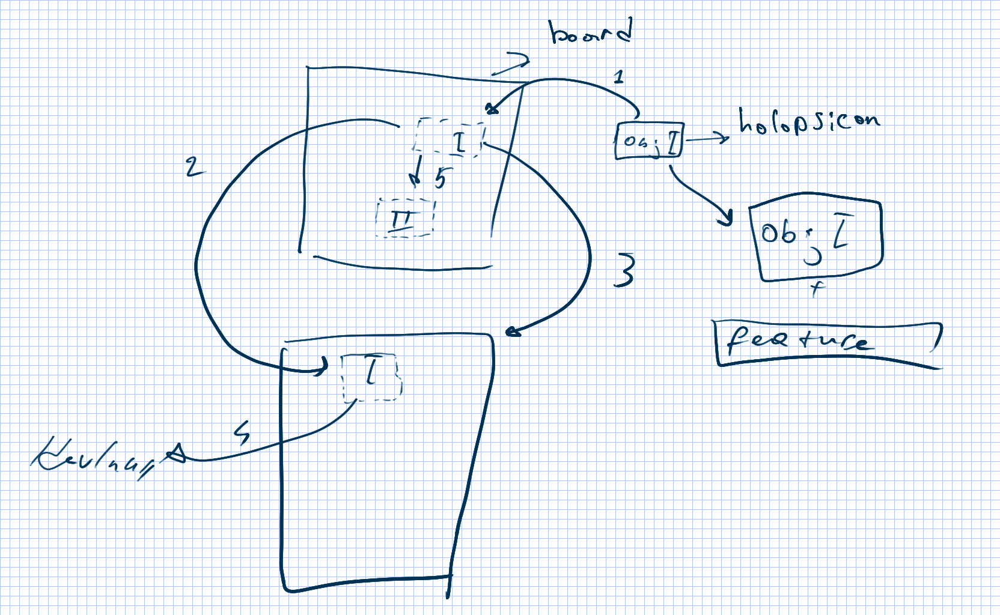

# Arutairu (アルタイル)

Union components. Making a components changeable.
```
Writing BackEnd and FrontEnd in different languages, so it may be replaceable.
```





### ANIME titles
```
Isaac Asimov's "Three Laws of Robotics"
  A robot may not injure a human being or, through inaction, allow a human being to come to harm.
  A robot must obey orders given it by human beings except where such orders would conflict with the First Law.
  A robot must protect its own existence as long as such protection does not conflict with the First or Second Law.
```
- [x] Pale Cocoon
- [ ] Blame!
- [ ] Eve no Jikan

### FrontEnd :: ui, view plugins and themes.
#### Project Structure
```
/src
  /components
    ;
    ; Routes <- Apps <- Boards <- Tools <- Utils
    ;
    /Routes   - Pages for each routes
    /Boards   - Working with types
    /Apps     - Applications ? (page::[Board->(tools->utils)])
    /Utils    - Utils ?
    /Tools    - Tools ?

```
### BackEnd :: db, RESTful API.
